Aqui está um **guia completo e fácil de decorar** sobre **acesso a serviços do Azure**, com dicas para provas e cenários reais:

---

### **1. Tipos de Acesso no Azure**  
| **Mecanismo**               | **Quando Usar**                                                                 | **Exemplo**                          |
|------------------------------|---------------------------------------------------------------------------------|---------------------------------------|
| **Pontos de Extremidade de Serviço (Service Endpoints)** | Conectar VNets a serviços PaaS (Storage, SQL, IA) **sem sair da rede Azure**. | `Visão Personalizada acessada por uma VM na mesma região`. |
| **Private Link (Endpoint Privado)** | Acesso **totalmente privado** via IP privado (evita internet). | `Conexão segura ao Cosmos DB de uma VNet`. |
| **Firewall (IPs Públicos)**  | Restringir acesso a intervalos de IPs específicos (para acesso público). | `API de IA acessível apenas do escritório corporativo`. |
| **RBAC (Controle de Acesso)** | Gerenciar **quem** pode acessar o recurso (não controla rede). | `Permitir que um dev acesse o Key Vault`. |
| **Tokens de Acesso**         | Autenticar solicitações (ex.: API Keys, SAS Tokens). | `Chave de API para chamar o Cognitive Services`. |

---

### **2. Dicas para Provas (Como Escolher a Resposta Correta)**  
#### **A. Palavras-chave na Pergunta**  
- **"Ponto de extremidade de serviço"** → **Service Endpoint** (conceda acesso à VNet).  
- **"Acesso privado"** ou **"IP privado"** → **Private Link**.  
- **"Intervalo de IPs"** → **Firewall com regras de IP**.  
- **"Permissões"** ou **"função"** → **RBAC**.  
- **"Token"** ou **"chave"** → **Autenticação (não é rede!)**.  

#### **B. Fluxo Lógico**  
1. **É sobre rede?**  
   - Sim → Service Endpoint, Private Link ou Firewall.  
   - Não → RBAC ou Tokens.  
2. **Precisa de total privacidade?**  
   - Sim → **Private Link**.  
   - Não → Service Endpoint ou Firewall.  

#### **C. Exclusão por Eliminação**  
- Se a opção falar em **"função" ou "usuário"**, descarte (é RBAC).  
- Se falar em **"token"**, descarte (é autenticação).  

---

### **3. Exemplos Práticos (Provas e Cenários)**  
#### **Cenário 1:**  
- *"Sua VM precisa acessar o Storage Account sem passar pela internet."*  
  - **Resposta:** **Service Endpoint** (vincula a VNet ao Storage).  

#### **Cenário 2:**  
- *"Seu banco de dados SQL deve ser acessível apenas por um IP específico."*  
  - **Resposta:** **Firewall com regra de IP**.  

#### **Cenário 3:**  
- *"Um aplicativo em uma VNet precisa acessar o Cognitive Services via IP privado."*  
  - **Resposta:** **Private Link**.  

---

### **4. Comparação Entre Service Endpoint vs. Private Link**  
| **Característica**       | **Service Endpoint**                  | **Private Link**                     |  
|--------------------------|---------------------------------------|--------------------------------------|  
| **Acesso**               | Ainda usa rede Azure (não é 100% privado). | Totalmente privado (via IP privado). |  
| **Custo**                | Gratuito.                             | Pago (cobrança por endpoint).        |  
| **Cenário Típico**       | Serviços PaaS na mesma região.        | Conformidade rigorosa (ex.: HIPAA).  |  

---

### **5. Mnemônicos para Decorar**  
- **"SEP VNet"** → **S**ervice **E**ndpoint **P**recisa de **VNet**.  
- **"PL = Privado"** → **P**rivate **L**ink é para **L**igações **P**rivadas.  
- **"RBAC = Quem"** → Controla **quem** acessa, não **como**.  

---

### **6. Armadilhas Comuns**  
- **Service Endpoint ≠ Private Link**: O primeiro ainda roteia pela rede Azure; o segundo é 100% privado.  
- **Firewall com IPs ≠ Service Endpoint**: O primeiro é para acesso público restrito; o segundo para redes Azure.  
- **RBAC não controla rede!** Sobre permissões, não conectividade.  

---

### **Resumo Visual**  

```mermaid
flowchart TD
    A[Precisa acessar serviço Azure?] --> B{É sobre rede?}
    B -->|Sim| C[Privacidade total?]
    C -->|Sim| D[Private Link]
    C -->|Não| E[Service Endpoint ou Firewall]
    B -->|Não| F[RBAC ou Token]
```

---

Com esse guia, você consegue responder 90% das questões sobre acesso no Azure! Quer um quiz para testar? 😊