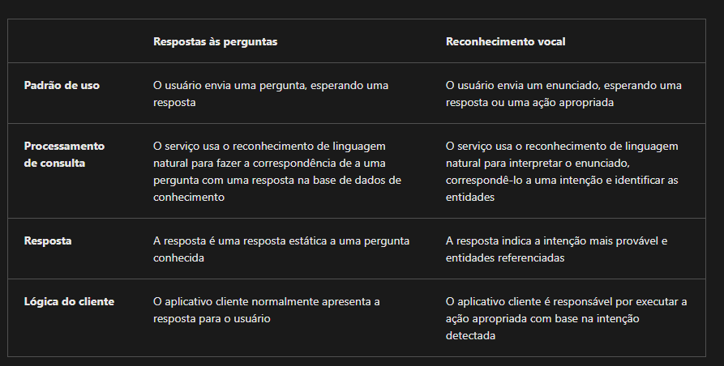

# Criar soluções de respostas às perguntas com a Linguagem de IA do Azure

## Entender respostas e perguntas

- A linguagem de IA do Azure, inclui um recurso de *respostas à perguntas* que permite definir uma base de conhecimento de pares de perguntas e respostas que podem ser utilizadas usando entrada de linguagem natural.
- A base de dados de conhecimento pode ser publicada em um ponto de extremidade REST e consumida por aplicativos clientes, normalmente *bots*
- A base de dados pode ser criada a partir das seguintes fontes:
  - Sites que contém documentação de FAQ
  - Arquivos que contém texto estruturado, como folhetos ou guias de usuário
  - Pares de perguntas e respostas de *bate-papo* integrados que encapsulam trocas de conversação comum

## Comparar as respostas às perguntas com a compreensão da Linguagem de IA do Azure

- Uma base de conhecimento de resposta às perguntas é uma forma de modelo de linguagem
- 

## Como criar uma base de dados de conhecimento

- Para criar uma solução de respostas a perguntas, é possível usar a API REST e SDKs para escrever um código que defina, treine e publique a base de conhecimento. Entretando é mais comum utilizar a interface web do estúdio de linguagem.
- Para criar a base deve:
  - Entrar no porta azure
  - Pesquisar servuços de ia do azure
  - Selecionar **criar** o recurso **Serviço de Linguagem**
  - Criar o recurso na assinatura azure:
    - Habilitar o recurso de *resposta às perguntas*
    - Criar ou selecionar o recurso **Pesquisa de IA do Azure** para hospedar o índice de base de dados de conhecimento
  - No estúdio de linguagem, selecione o recurso de Linguagem de IA do Azure e crie o projeto *resposta às perguntas personalizadas*
  - Adicione uma ou mais fontes de dados para preencher a base de conhecimento:
    - URL's contendo perguntas frequentes
    - Arquivos contendo texto estruturado a partir do qual perguntas e respostas podem ser derivadas
    - Conjunto de dados de bate-papo predefinidos que incluem perguntas e respostas comuns de conversas em um estílo específico
  - Editar os pares de perguntas e respostas do portal

## Implementar conversa com várias rodadas

- Você pode habilitar respostas multi-turn ao importar perguntas e respostas de uma página da web existente ou documento com base em sua estrutura, ou você pode definir explicitamente prompts de acompanhamento e respostas para perguntas e pares de respostas existentes.

## Testar e publicar uma base de dados de conhecimento

- Depois de definir uma base de dados de conhecimento, você pode treinar seu modelo de linguagem natural e testá-lo antes de publicá-lo para uso em um aplicativo ou bot.

- Testar uma base de dados de conhecimento:
  - É possível testar a base no language studio, fazendo perguntas e revisando as respostas que são retornadas
- Implantar uma base de conhecimento:
  - Quando a base de conhecimento já estiver funcional, é possível implementar no terminal REST para que os app client consigam enviar perguntas e receber respostas. Deve-se implantar diretamente do Estúdio de Linguagem.

## Usar uma base de dados de conhecimento

- Para consumir a base de conhecimento publicado, pode-se usar a interface REST
- O corpo do envio da solicitação deve conter:
  - pergunta: pergunta enviada pelo cliente
  - top: número máximo de resposta possíveis
  - scoreThreshold: limite de pontuação a respostas a serem enviadas
  - strictFilters: limite de respostas que contém metadados específicos

## Aprimorar o desempenho de respostas às perguntas

- Pode-se melhorar o desempenho das respostas das maneiras a seguir

- Aprendizado ativo: 
  - Os usuário podem realizar perguntas formuladas de forma diferentes, mas serem do mesmo contexto
  - O aprendizado ativo pode ajudar em situações como essa, pois habilita a consideração de perguntas alternativas para cada par de perguntas e respostas.
  - Para o aprendizado ativo é possível:
    - Criar seus pares de perguntas e respostas: 
    - Analisar sugestões, fazendo o aprendizado ativo oferecer sugestões a pares de perguntas
    - Definir sinônimos